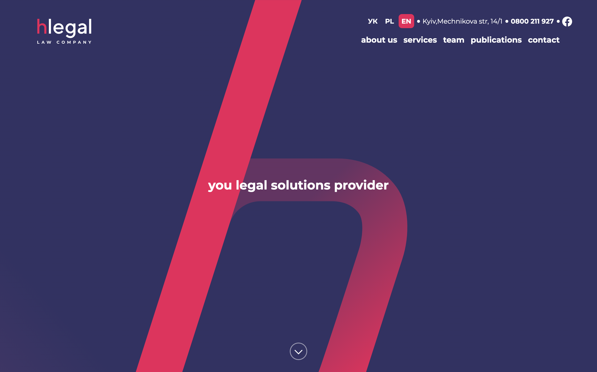
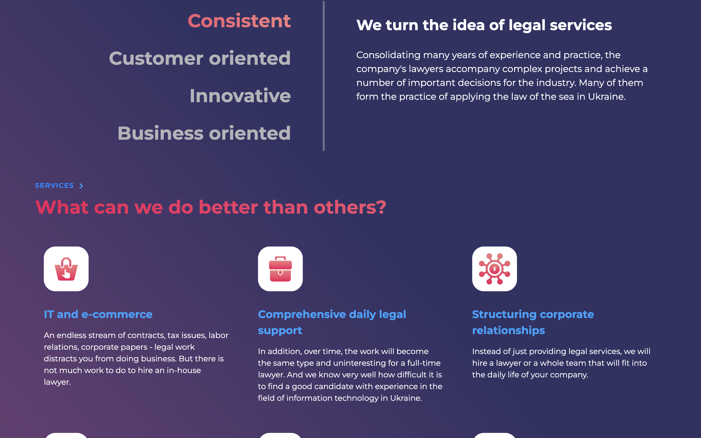
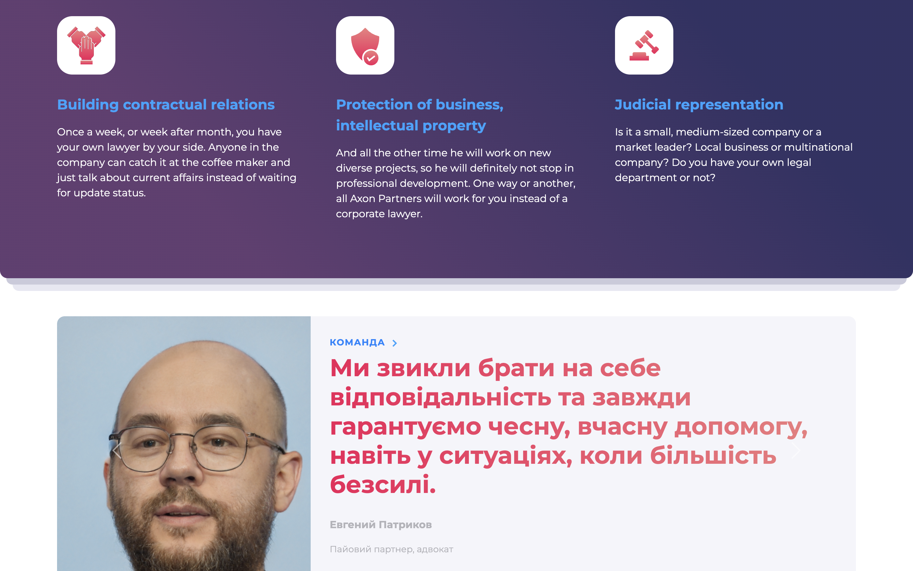

# Hlegal-public
This project is my graduation project in my frontend courses. In it, I will use the bootstrap frame work, the SCSS preprocessor. I will make a cross-browser layout 
Here is the link to the project   https://andrew10x10.github.io/Hlegal-public/
 Аnd these screenshots are a small part of the project

